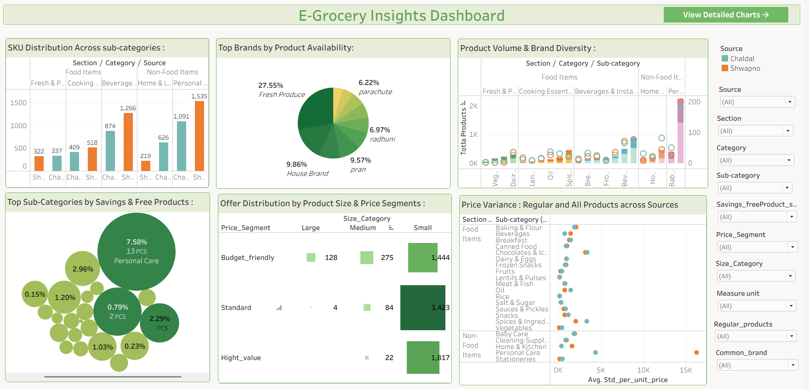
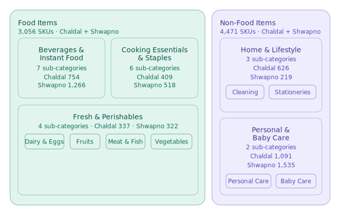

# 🛒 E-Grocery Insights: Decoding Product Diversity and Savings in Online Groceries

Extracted and analyzed **7,197 product listings** from **Chaldal** and **Shwapno** — two leading Bangladeshi e-grocery platforms — uncovering brand distribution, 
promotional savings, offer patterns, and price variance through data-driven analysis and Tableau visualizations.


<br>

## 📊 Dashboard Preview
 
 > To explore each chart individually in detail, click **"View Detailed Charts"** or use the **"button"** at the top-right of the dashboard.

**[View Interactive Dashboard](https://public.tableau.com/app/profile/bithi.nath/viz/visualization_1_17772762990980/Dashboard)**
 &nbsp;|&nbsp; **[View Detailed Charts](https://public.tableau.com/app/profile/bithi.nath/viz/visualization_1_17772762990980/Detailedcharts?publish=yes)**


<div align="center">
  
</div>

<br>

## 📌 About

Bangladesh's e-grocery sector is experiencing rapid growth, driven by factors such as bulk purchase discounts, exclusive product offers, free delivery above certain order thresholds, and the convenience of time-saving shopping. These incentives are reshaping how urban consumers purchase daily essentials. However, with multiple platforms offering varying prices, brands, and deals, consumers often struggle to identify where they can save the most. This project bridges that gap by scraping real-time grocery data from two major e-grocery sources in Bangladesh, enabling a data-driven comparison at the sub-category and brand level.
Rather than direct product matching, this project focuses on market-level trends to uncover:
- Which platform and product sub-categories offer the most savings
- How brand availability differs across platforms
- How offers vary by product size and price segment
- Which top 10 brands dominate by product listing on each platform
- Which platform offers lower prices across all products and regularly purchased items of common brands, analyzed by price segment and category

## 🔍 Project Scope
- Platforms covered: [Chaldal](https://chaldal.com/) and [Shwapno](https://www.shwapno.com/)
- Data collection method: **Dynamic web scraping** using Selenium
- Total product listings: **7,197** (Chaldal: 3,337 | Shwapno: 3,860)
- Data points collected per product: Title, Previous price, Current price, Unit, Stock and more
- Additional columns derived during cleaning: Section, Category, Sub-category, Brand, Offer, Toal Savings, Price Segment, Size Category, common brands and more
- Total unique brands identified: **~700**
- Data collected: **Late March 2026**

## ⚠️ Limitations
- **~890 duplicate** entries, including a few null values, were removed during cleaning.
- **~350 products** appearing in multiple sub-categories were cleaned by retaining only the listing under their most relevant sub-category.
- The same product may appear with different prices or unit sizes, as pricing and packaging vary across platforms.
- Brand names were extracted from product titles using keyword frequency analysis, followed by manual correction — resulting in **~700 unique brands** identified.
- **~4,000 products** had generic units (pcs, each, pack, etc.), so an `Extra_info` column was extracted from titles to determine actual unit, `offer_status`, `Total_savings`, `Actual_unit_price`, and `Market_price`.
- Out-of-stock status on Chaldal could not be scraped, so such few products remain in the dataset and may slightly bias the results.

<br>

## 📊 Data Overview
<div align="center">
  <h2>Product Taxonomy</h2>
  <h3>Section → Category → Sub-Category</h3>
  
</div>

<br>

## ✨ Features

### 📊 **Graph-1 :** SKU Distribution Across sub-categories :
   >  Compares total product listings across Chaldal and Shwapno by section, category, and sub-category.

   -  **Personal Care** & **Snacks** lead in SKU volume across both platforms, with **Shwapno** holding a significantly **larger sub-catalogue** in both.
   -  Shwapno consistently lists more products than Chaldal across most sub-categories in the food-items section.
   -  In **Non-Food**, **Chaldal outperforms** Shwapno in all sub-categories except Personal Care.
   -  **Fruits**, **Lentils & Pulses**, **Salt**, **Spices**, and **Canned Food** have the **lowest SKU** counts across both platforms.

### 🥧 **Graph-2:** Top Brands by Product Availability:
  >  Shows which top 10 brands hold the largest share of products per platform.

   - The largest share comes from **Fresh Produce (Unbranded)** and **Unknown Brand**—local items without brands and products with no identifiable brand in the title.
   - **House Brands** rank next, mainly driven by Shwapno; Chaldal has relatively low presence.
   - **Pran** and **ACI** consistently rank within the top 3 across both platforms — making them the most dominant **named brands** in the market.
   - Platform-wise ranking: **Shwapno:** Pran > ACI > Radhuni and **Chaldal:** Fresh Produce > Pran > ACI

  
### 📊 **Graph-3:** Product Volume & Brand Diversity :
  >  Product Volume & Brand Diversity shows how product availability and brand presence vary across sub-categories and between platforms.
  
   - In most sub-categories, a higher number of products corresponds to a higher number of brands across both platforms.
   - **Personal Care** has the highest concentration of both products and brands.
   - In **Snacks**, both platforms have a similar number of brands.
   - In some other sub-categories, both brands and products are relatively low and almost similar across platforms, indicating **lower demand** and purchase activity, which results in **limited brand presence**.
   - **Fruits** & **Vegetables** have little to no brand presence, as these are mostly local, unbranded items. However, a few brands are present in the **Meat & Fish** sub-category.
   
### 🫧 **Graph-4:** Top Sub-Categories by Savings & Free Products : 

> Shows combined count of discounted and free products per sub-category across both platforms.

  -  Shwapno & Chaldal both concentrate the **highest savings & free products** in the **Non-Food** section.
  -  Shwapno leads in **Personal Care, Beverages & Snacks** — both for money savings and free product count.
  -  Chaldal leads in Baby Care with maximum savings, while Personal Care tops in free product availability.
  -  Across both platforms, Personal Care consistently ranks as the top sub-category for free product availability.
  
 ### 🌡️ **Graph-5:** Offer Distribution by Product Size & Price Segments :
  > Shows the count of discounted products across price segments (Budget-friendly, Standard, High-value) and size categories (Large, Medium, Small).

  - **Small** sized products dominate offers across all price segments, with **Standard** segment leading the highest offer count.
  - **Large** sized products have the least offer availability across all segments, with **Standard & High-value** having almost no Large product offers.
  
### 📉 **Graph-6:** Price Variance between Regular and All Products across Sources :
   > Compares avg. standard price per unit between Chaldal and Shwapno across Food & Non-Food sub-categories, progressively filtered by regular products, common brands, price segments and size category.

   - **Personal Care** shows the highest price variance across all products —  Shwapno skews significantly higher, likely due to a wider range of **product variants** within platforms.
   - Among **regular products with common brands**, notable price gaps persist — likely reflecting **different product variants within the same brand**, as exact product-level matching was not applied.
   - **High-value** segment shows the widest price gap, while **Budget-friendly** remains the most closely aligned across both platforms.
   - Filtering by **measure unit** (e.g., kg, ltr) would reduce variance from pack size differences — however, **product variety within the same brand** may still contribute to remaining price gaps.

<br>

## ⚙️ Quick Start

1. 🔽 Clone Repository
   
   ```
     git clone https://github.com/bithiNath/E-Grocery-Insights-BD.git
     cd E-Grocery-Insights-BD
   ```

2. 🐍 Setup Environment (Windows-friendly)
   
   ```
    python -m venv venv
    venv\Scripts\activate
   ```
   
3. 📦 Install minimal dependencies
   
   ```
    pip install -r requirements.txt
   ```
   
4. ▶️ Run Data collection Script
   
    ```
      python src/data_Scraping_chaldal.py
      python src/data_scraping_shwapno.py
    ```
   
5. 🧹 Run Data Cleaning (Notebook)
    
    ```
      data_cleaning.ipynb
    ```
   
 6. 📂 Data Information
    
    ```
      - Raw data is excluded (.gitignore)
      - Available required data: `data/interim/combined_data_BrandName_cleaned_3.csv`
      - Generate other data using scripts and notebook
    ```

 7. 📊 Open Tableau Dashboard : [Click here for Tableau public view](https://public.tableau.com/app/profile/bithi.nath/viz/visualization_1_17772762990980/Dashboard) 
 &nbsp;|&nbsp; **[View Detailed Charts](https://public.tableau.com/app/profile/bithi.nath/viz/visualization_1_17772762990980/Detailedcharts?publish=yes)**


<br>

## Project Stucture

```text
E-Grocery Insights/
│
├── data/
│   ├── raw/                                           
│   │   └── .gitkeep                                   # Step 1: CSV files are git-ignored; run scraper to get data
│   │
│   ├── interim/  
|   |   ├── combined_data_BrandName_3.csv              # Step 3: For brand name identification only — not used in final analysis; run notebook to generate
│   │   └── combined_data_BrandName_cleaned_3.csv      # Step 4: Manually cleaned version — used to extract final brand name list
│   │   
│   └── processed/
│       └── .gitkeep                                   # Step-5: CSV files are git-ignored; run scraper to get data
│
├── notebook/
│   └── data_cleaning.ipynb                            # Step 2: Cleaning data
│
├── assets/
│   └── visualization                                  # Step-6 : Deshboard Preview
│
├── requirements.txt                                   # Step-7 : Required libraries
|
├── .gitignore                                         # Step - 8 : Project Configuration
|
└── README.md                                          # Step-9 : Project Documentation
```

<br>

## 🎯 Future Goals
- Incorporate statistical analysis on the existing dataset
- Automate scraping with scheduled runs to track price changes over time
- Conduct seasonal analysis (e.g., Ramadan, Eid effects) and visualize through Power BI
- Expand to more e-grocery platforms for broader market comparison


## 📜 License

This project is licensed under the MIT License - see the LICENSE file for details.


## ⚠️ Disclaimer
This project is created for educational purposes to practice data analysis and visualization. The data used was collected from publicly available sources. This project does not aim to harm, misuse, or violate the terms of any platform.


## 🤝 Contributing

Contributions are welcome! Feel free to open an issue or submit a pull request.


## 📬 Contact

- **GitHub:** [@bithiNath](https://github.com/bithiNath)
- **LinkedIn:** [Bithi Nath](https://linkedin.com/in/bithinath)

---

<br>

<p align="center">Developed by <a href="https://github.com/bithiNath">@bithiNath</a> ⚡</p>
